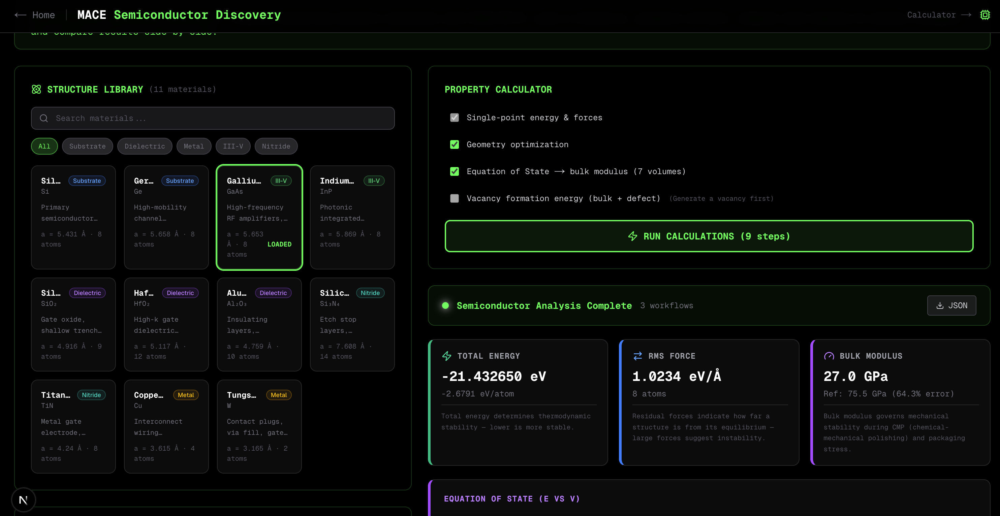
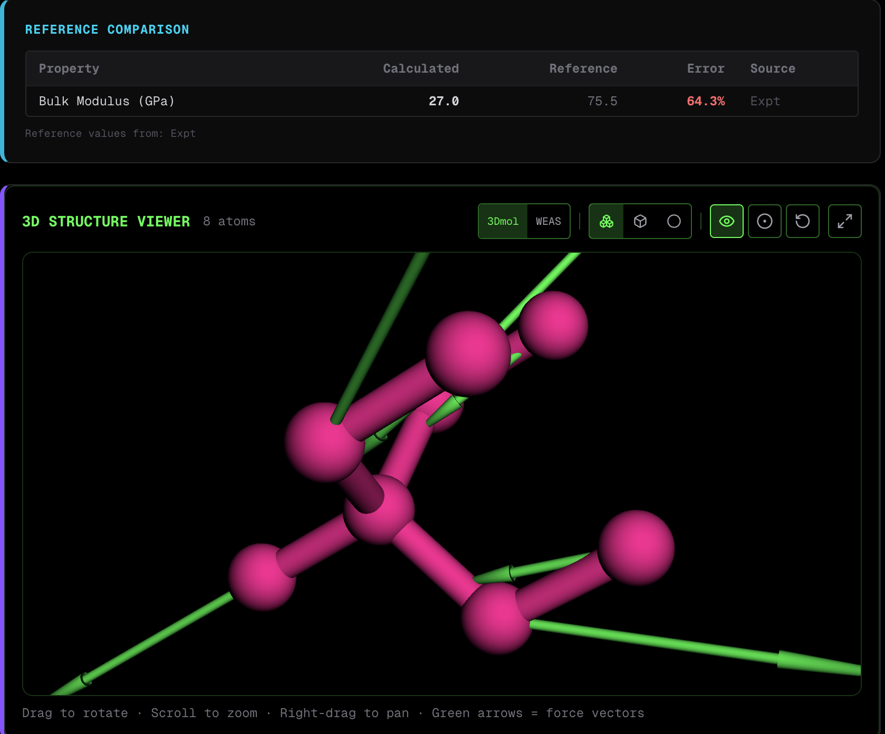

<div align="center">

# MACE Force Fields — Web Calculator

**One of the first web-based interfaces with fine UI design for machine learning interatomic potentials.**
**No coding required. Upload a structure, pick parameters, get results.**

<p>
  <a href="https://github.com/Jamessfks/mace/releases"></a>
  <a href="https://github.com/Jamessfks/mace/blob/main/LICENSE"></a>
  <a href="https://www.python.org/"></a>
  <a href="https://nextjs.org/"></a>
  <a href="https://github.com/ACEsuit/mace"></a>
  <a href="https://github.com/Jamessfks/mace"></a>
  <a href="https://github.com/Jamessfks/mace"></a>
</p>

Built by a team of CS first-year students at **Northeastern University**

[Features](#features) · [Quick Start](#quick-start) · [Screenshots](#screenshots) · [Architecture](#architecture) · [Deploy](#deploy-online) · [Reference Data](#semiconductor-reference-data)

</div>

---

> *"In the science community, you rarely see a disabled scientist." — Professor Cabrera*
>
> *How many talented scientists are we losing because of inaccessible tools? We want to be the pioneers of creating an accessible scientific web interface, encouraging the science community to respect people with needs.*

> **318 unique cloners in 7 days** — viral by academic software standards. The science community is actually using the web interface.

**Team:** Zicheng Zhao(zhao.zic@northeastern.edu), Arya Baviskar, Isaac Sohn, Harshitha Somasundaram, Kartik Patri
&nbsp;|&nbsp; Built on the [MACE API](https://github.com/ACEsuit/mace)

---

## Screenshots

<div align="center">



<br/>

<table>
<tr>
<td width="55%">

**11 chip-relevant materials** — Si, Ge, GaAs, InP, SiO₂, HfO₂, Al₂O₃, Si₃N₄, TiN, Cu, W — with verified experimental reference data. Select a material, run MACE-MP-0, and compare calculated bulk modulus and vacancy energy against Ioffe NSM, NIST, and Materials Project.

</td>
<td width="45%">



</td>
</tr>
</table>

</div>

---

## Features

### General Calculator (`/calculate`)

| Feature | Description |
|---------|-------------|
| **File Upload** | `.xyz`, `.cif`, `.poscar`, `.pdb` formats |
| **Models** | MACE-MP-0 (89 elements, materials) · MACE-OFF (organic molecules) |
| **Calculations** | Single-point energy · Geometry optimization · Molecular dynamics |
| **Output** | Energy, forces, 3D viewer, MD trajectory animation, PDF report |

### Semiconductor Materials Discovery (`/semiconductor`)

| Feature | Description |
|---------|-------------|
| **Structure Library** | 11 pre-built materials across 5 categories (substrates, III-V, dielectrics, nitrides, metals) |
| **Property Calculator** | Single-point · Geometry opt · EOS bulk modulus · Vacancy formation energy |
| **Defect Generator** | Vacancy structures (atom removal) · Surface slabs (Miller indices + ASE) |
| **Reference Comparison** | Calculated vs experimental with % error (Ioffe NSM, Materials Project, NIST) |
| **Confidence Indicator** | Traffic-light gauge for MACE-MP-0 reliability per element coverage |
| **Comparison View** | Side-by-side bulk vs vacancy with dual 3D viewers |

---

## Quick Start

### Prerequisites

| Tool | Version | Install |
|------|---------|---------|
| Node.js | v18+ | [nodejs.org](https://nodejs.org) |
| Python | 3.10+ | [python.org](https://www.python.org/downloads) |

### Setup

```bash
# 1. Clone
git clone https://github.com/Jamessfks/mace.git
cd mace

# 2. Install frontend
npm install

# 3. Install backend
pip install mace-torch ase

# 4. Run
npm run dev
```

Open **[http://localhost:3000](http://localhost:3000)** — that's it. No cloud, no sign-ups.

> **Note:** First calculation may take ~30s while the MACE model downloads. Subsequent runs are fast.

### Try It

<table>
<tr>
<td width="50%">

**General Calculator**
1. Go to `/calculate`
2. Upload a `.xyz` file
3. Pick a model (MACE-MP-0 or MACE-OFF)
4. Click **RUN MACE CALCULATION**
5. View energy, forces, 3D structure

</td>
<td width="50%">

**Semiconductor Discovery**
1. Go to `/semiconductor`
2. Select a material (Si, GaAs, HfO₂…)
3. Choose workflows (EOS, vacancy…)
4. Click **RUN CALCULATIONS**
5. Compare results to reference data

</td>
</tr>
</table>

---

## Architecture

```
Browser (localhost:3000)
    │
    ├── /calculate ──────────────────── /semiconductor
    │        │                                │
    │   Upload file + params          Select from library
    │        │                         + choose workflows
    ▼        │                                │
Next.js API routes                            │
    │                                         │
    ├── /api/calculate                Multiple /api/calculate calls
    │        │                        (7 for EOS, 2 for vacancy)
    │   Python subprocess                     │
    │        ▼                        ├── /api/generate-surface
    │   calculate_local.py            │        │
    │        │                        │   generate_surface.py (ASE)
    ▼        ▼                        ▼        ▼
Results in browser              Results in browser
  + 3D viewer                     + reference comparison
  + MD animation                  + EOS chart (E vs V)
  + PDF report                    + confidence indicator
                                  + bulk vs vacancy view
```

| Flow | How It Works |
|------|-------------|
| **General** | Upload → `/api/calculate` → Python subprocess → `calculate_local.py` → JSON → browser |
| **EOS** | Scale cell to 7 volumes → 7x single-point → polynomial E(V) fit → B₀ = V₀ × d²E/dV² |
| **Vacancy** | Bulk + defect calculations → E_vac = E_defect − E_bulk × (N−1)/N |
| **Surface** | `/api/generate-surface` → `generate_surface.py` → ASE `surface()` builder |

---

## Deploy Online

<table>
<tr>
<td width="50%">

### Frontend — Vercel

1. Push to GitHub
2. Import repo at [vercel.com](https://vercel.com)
3. Set env var `MACE_API_URL` → your backend URL

</td>
<td width="50%">

### Backend — Railway

1. Create project at [railway.app](https://railway.app)
2. Deploy from `mace-api/` folder
3. Copy URL → set as `MACE_API_URL` in Vercel

</td>
</tr>
</table>

When `MACE_API_URL` is set, the frontend forwards calculations to the remote backend instead of running Python locally.

---

## Models

| Model | Best For | Elements | Source |
|-------|----------|----------|--------|
| **MACE-MP-0** | Materials, crystals, bulk solids | 89 elements | [ACEsuit/mace](https://github.com/ACEsuit/mace) |
| **MACE-OFF** | Organic molecules, drug-like molecules | H, C, N, O, P, S, F, Cl, Br, I | [ASL License](https://github.com/gabor1/ASL) |

Models download automatically on first use and are cached locally.

---

## Semiconductor Reference Data

All reference values in `lib/semiconductor-constants.ts` verified against primary experimental sources:

| Material | a (Å) | B (GPa) | E_vac (eV) | Source |
|----------|--------|---------|------------|--------|
| Si (diamond) | 5.431 | 98 | 3.6 | Ioffe NSM, PRL 56 2195 |
| Ge (diamond) | 5.658 | 75 | 2.5 | Ioffe NSM, SSP 131-133 |
| GaAs (zincblende) | 5.653 | 75.5 | — | Ioffe NSM |
| InP (zincblende) | 5.869 | 71 | — | Ioffe NSM |
| HfO₂ (monoclinic) | 5.117 | 189 | — | Materials Project PBE |
| SiO₂ (α-quartz) | 4.916 | 37.1 | — | Brillouin spectroscopy |
| Si₃N₄ (β) | 7.608 | 259 | — | NIST Brillouin scattering |
| Al₂O₃ (corundum) | 4.759 | 254 | — | X-ray diffraction |
| Cu (FCC) | 3.615 | 140 | 1.28 | Experimental + DFT |
| W (BCC) | 3.165 | 310 | 3.67 | Maier 1979 (quenching) |
| TiN (rocksalt) | 4.240 | 288 | — | Literature consensus |

<details>
<summary><strong>EOS Methodology</strong></summary>

The EOS fitting uses a cubic polynomial approximation to the Birch-Murnaghan equation of state, valid for small volume deformations (±6%). Bulk modulus is extracted as B₀ = V₀ × d²E/dV² at the energy minimum. The eV/ų → GPa conversion uses the exact CODATA value (160.2176634).

</details>

---

## Project Structure

<details>
<summary><strong>Click to expand full file tree</strong></summary>

```
mace/
  app/
    api/
      calculate/route.ts         # API route — local Python or remote MACE API
      generate-surface/route.ts  # Surface slab generation via ASE
    calculate/page.tsx           # General calculator page
    semiconductor/page.tsx       # Semiconductor discovery page
    globals.css
    layout.tsx
    page.tsx                     # Landing page
  components/
    calculate/
      file-upload-section.tsx    # Upload zone + ml-peg catalog
      mlpeg-catalog.tsx          # ml-peg benchmark browser
      molecule-viewer-3d.tsx     # 3Dmol.js + WEAS dual viewer
      parameter-panel.tsx        # Model & calculation params
      pdf-report.tsx             # PDF report generator
      results-display.tsx        # Energy, forces, viewer
      structure-info.tsx         # Parsed structure info + warnings
      structure-preview.tsx      # Click-to-display 3D preview
      weas-viewer.tsx            # WEAS iframe viewer
      trajectory/
        trajectory-viewer.tsx    # MD animation player
        energy-chart.tsx         # SVG energy-vs-step chart
    semiconductor/
      structure-library.tsx      # Card grid — 11 materials
      defect-generator.tsx       # Vacancy + surface slab builder
      property-calculator.tsx    # Multi-step MACE workflows
      semiconductor-results.tsx  # Results + EOS chart + ref table
      confidence-indicator.tsx   # MACE reliability gauge
      comparison-view.tsx        # Bulk vs vacancy comparison
    ui/                          # shadcn/ui components
    Footer.tsx
    intro-section.tsx
  lib/
    mlpeg-catalog.ts             # ml-peg structure catalog
    parse-structure.ts           # XYZ/CIF/PDB/POSCAR parser
    semiconductor-structures.ts  # 11 semiconductor XYZ structures
    semiconductor-constants.ts   # Verified reference data
    semiconductor-properties.ts  # EOS fit + vacancy energy helpers
    utils.ts
  mace-api/
    calculate_local.py           # Local MACE calculation script
    generate_surface.py          # ASE surface generator
    main.py                      # FastAPI server (cloud deploy)
    requirements.txt
  types/
    mace.ts                      # Calculator type definitions
    semiconductor.ts             # Semiconductor type definitions
  public/                        # Static assets + screenshots
```

</details>

---

## Troubleshooting

| Problem | Solution |
|---------|----------|
| `node: command not found` | Install Node.js from [nodejs.org](https://nodejs.org) |
| `python3: command not found` | Install Python from [python.org](https://python.org). Windows: try `python` |
| `pip: command not found` | Try `pip3` or `python3 -m pip install ...` |
| `mace-torch` install fails | Install Python 3.10+. Try `pip install torch` first |
| First calculation is slow | Normal — model downloads on first use (~30s) |
| Calculation fails | Check terminal for Python errors. Verify `mace-torch` + `ase` installed |
| `npm run dev` fails | Run `npm install` first. Requires Node.js 18+ |

---

<div align="center">

**Built at Northeastern University** · Khoury College of Computer Sciences

Academic use · MACE-OFF under [Academic Software License](https://github.com/gabor1/ASL)

</div>
