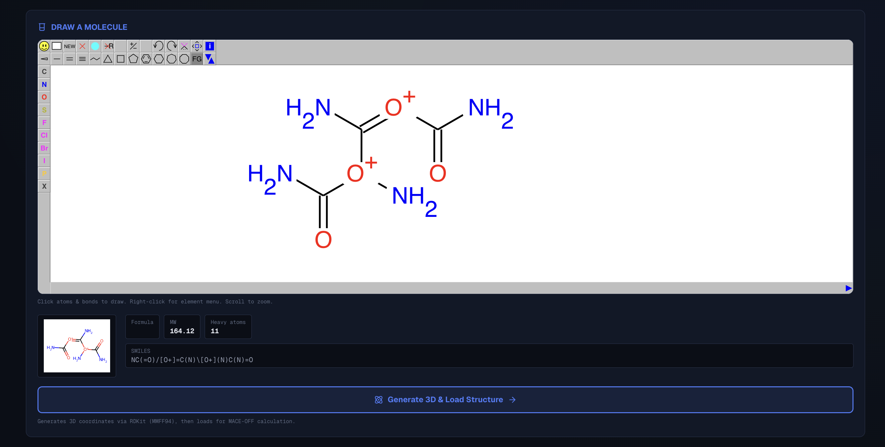
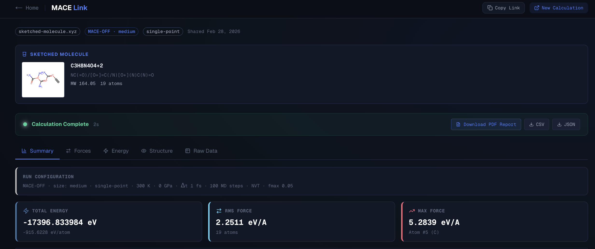

<div align="center">

# MACE Force Fields — Web Interface

**Run DFT-accuracy atomistic simulations entirely in your browser.**
**No installation. No command line. No barriers.**

<h3>
  <a href="https://mace-lake.vercel.app"> Live → mace-lake.vercel.app</a>
</h3>

<p>
  <a href="https://mace-lake.vercel.app"></a>
</p>

<p>
  <a href="https://github.com/Jamessfks/mace/releases"></a>
  <a href="https://github.com/Jamessfks/mace/blob/main/LICENSE"></a>
  <a href="https://www.python.org/"></a>
  <a href="https://nextjs.org/"></a>
  <a href="https://github.com/ACEsuit/mace"></a>
  <a href="https://github.com/Jamessfks/mace"></a>
  <a href="https://github.com/Jamessfks/mace"></a>
</p>

Built by **Zicheng Zhao** · Northeastern University

Contact: zhao.zic@northeastern.edu or zezepy070413@gmail.com

[See It in Action](#see-it-in-action) · [Why This Exists](#why-this-exists) · [Key Features](#key-features) · [Quick Start](#quick-start) · [Architecture](#architecture) · [Deploy](#deploy-online)

</div>

---

## See It in Action

<div align="center">

<table>
<tr>
<td width="50%" align="center">

**Draw a Molecule**



<sub>Draw any organic molecule with the built-in sketcher. Real-time validation, SMILES generation, and molecular descriptors — all in the browser.</sub>

</td>
<td width="50%" align="center">

**Share Results Instantly**



<sub>Every calculation becomes a permanent, shareable link. The full dashboard — energy, forces, 3D viewer, exports — available to anyone.</sub>

</td>
</tr>
</table>

</div>

<details>
<summary><strong>Watch the full walkthrough</strong></summary>

<div align="center">
<br/>

<video src="https://raw.githubusercontent.com/Jamessfks/mace/main/public/demo-video.mp4" width="100%" controls>
  Your browser does not support the video tag. <a href="public/demo-video.mp4">Download the video</a>.
</video>

*Draw a molecule → generate 3D coordinates → run MACE-OFF → explore results → share as a permanent link.*

<br/>
</div>

> **Tip:** If the video doesn't render on GitHub, download [`public/demo-video.mp4`](public/demo-video.mp4) to view locally.

</details>

---

## Why This Exists

> *"In the science community, you rarely see a disabled scientist."*
>
> *How many talented scientists are we losing because of inaccessible tools? We want to be the pioneers of creating an accessible scientific web interface, encouraging the science community to respect people with needs.*

Machine learning interatomic potentials like [MACE](https://github.com/ACEsuit/mace) (NeurIPS 2022) have reached a point where they rival density functional theory in accuracy while running orders of magnitude faster. But using them still requires Python scripting, command-line fluency, and environment setup that shuts out a large number of researchers, especially those with accessibility needs, those in under-resourced labs, or students encountering computational chemistry for the first time.

This project removes that barrier. Upload a crystal structure, draw a molecule on a canvas, or pick one from a catalog and get publication-quality results in seconds, from any browser.

---

## Key Features

### Sketch-a-Molecule

**Draw any organic molecule and run a simulation — no files, no code, no setup.**

Open the built-in sketcher (powered by [JSME](https://jsme-editor.github.io/)), draw bonds and atoms, and the interface handles everything: real-time validation via [RDKit.js](https://www.rdkitjs.com/) WASM, a 2D SVG preview with molecular descriptors, and one-click 3D coordinate generation through a multi-conformer physics pipeline.

**How a 2D sketch becomes a real 3D structure:**

1. **Distance bounds** — Min/max constraints between all atom pairs from bond lengths, angles, torsions, and van der Waals radii
2. **ETKDGv3 distance geometry** — Random distance matrices embedded in 3D, refined with experimental torsion preferences from the Cambridge Structural Database
3. **Multi-conformer sampling** — Up to 50 independent conformers explore the energy landscape
4. **MMFF94 optimization** — Each conformer is minimized with the Merck Molecular Force Field (1.30 kcal/mol mean error vs. coupled-cluster)
5. **Energy-ranked selection** — The lowest-energy conformer is selected as input for MACE-OFF

```
JSME editor → SMILES → RDKit.js validation + 2D SVG (browser)
  → /api/smiles-to-xyz → RDKit Python (ETKDGv3 + MMFF94) → XYZ
  → Auto-select MACE-OFF → Run calculation → Results dashboard
```

### MACE Link — Shareable Permanent Results

Every calculation can be shared as a permanent URL. Click **Share Result**, get a link like `mace-lake.vercel.app/r/gK7tabOE`, and anyone can view the full result — 3D viewer, metrics, charts, export options — without logging in. Drawn molecules embed the 2D structure, SMILES, formula, and molecular weight directly in the shared page. Results are stored in Supabase with row-level security: once created, a shared result cannot be modified or deleted.

### Scientific Calculator

| Capability | Details |
|---|---|
| **Structure input** | Drag-and-drop upload (`.xyz`, `.cif`, `.poscar`, `.pdb`), [ml-peg catalog](https://github.com/ACEsuit/mace) (14 benchmark structures), or draw a molecule |
| **Foundation models** | MACE-MP-0 (89 elements, materials & crystals) and MACE-OFF (organic molecules, DFT-level accuracy). Small, medium, and large variants |
| **Custom models** | Upload your own `.model` file — compare side-by-side against foundation models with radar charts (MAE, RMSE, R²) |
| **Calculation types** | Single-point energy & forces, geometry optimization (BFGS), molecular dynamics (NVE / NVT / NPT) |
| **Parameter control** | Temperature, pressure, time step, friction, MD steps, force threshold, D3 dispersion correction, precision, device |

### Visualization & Analysis

| Feature | Details |
|---|---|
| **3D molecular viewer** | Dual-engine rendering (3Dmol.js + WEAS) with force vector overlays, multiple representations, spin, and fullscreen |
| **Metrics dashboard** | Five-tab interface — Summary, Forces, Energy, Structure, Raw Data — with interactive Plotly charts |
| **MD trajectory player** | Frame-by-frame animation with playback controls, adjustable speed, and an energy chart synced to the current frame |
| **Structure intelligence** | Auto-detects format, counts atoms and elements, computes bounding box, warns about large structures or multi-frame files |
| **Export** | PDF reports, CSV force tables, JSON results, PNG/SVG charts — everything needed for a publication or notebook |

### Multi-Model Benchmark Suite

Navigate to `/benchmark` to batch-evaluate 2–3 models across multiple structures. Results include a sortable leaderboard, force comparison bar charts, timing analysis with speedup ratios, energy landscape plots, and a pairwise model agreement heatmap. Export everything as CSV, JSON, or a formatted PDF.

### Accessibility & Design

The interface is built with accessibility as a first principle, not an afterthought:

- **Keyboard navigation** throughout — focus rings, Space to play/pause trajectory animations
- **ARIA labels and semantic HTML** — screen readers can traverse the full calculation workflow
- **Colorblind-safe data palette** — Paul Tol's qualitative scheme across all visualizations
- **Dark scientific aesthetic** — ambient glow effects, dot-grid patterns, and an animated water MD simulation on the landing page, inspired by research-tool interfaces like Schrödinger

---

## Quick Start

```bash
git clone https://github.com/Jamessfks/mace.git && cd mace
npm install                    # frontend dependencies
pip install mace-torch ase     # backend (MACE + ASE)
pip install rdkit-pypi         # required for Sketch-a-Molecule
npm run dev                    # → http://localhost:3000
```

> The first calculation takes ~30 seconds while models download. Subsequent runs are fast.

**Try the guided demo:** visit `http://localhost:3000/calculate?demo=true` — it loads an ethanol molecule and walks you through the interface step by step.

**Try the sketcher:**

1. Go to `/calculate` → click **Draw Molecule**
2. Draw a molecule (aspirin, caffeine, ibuprofen — anything organic)
3. Click **Generate 3D & Load Structure**
4. Click **RUN MACE CALCULATION**
5. Explore the tabbed results dashboard, then click **Share Result** to get a permanent link

---

## Architecture

```
Browser (localhost:3000)
    │
    ├── /                           Landing page with animated water MD background
    │
    ├── /calculate                  Calculator — [Upload File | Draw Molecule] toggle
    │       ├── Draw mode ──▶ JSME editor → SMILES → /api/smiles-to-xyz
    │       │                   → RDKit 3D coords → auto-load as .xyz
    │       └── Upload mode ──▶ Drag-and-drop / ml-peg catalog
    │
    ├── /benchmark                  Multi-model benchmark suite
    │
    ├── /r/[id]                     MACE Link — shared result viewer
    │
    ▼
    Next.js API Routes
         ├── /api/smiles-to-xyz     SMILES → 3D XYZ (RDKit multi-conformer + MMFF94)
         ├── /api/calculate         MACE calculation (single-point / opt / MD)
         ├── /api/benchmark         Batch evaluation (model × structure pairs)
         └── /api/generate-surface  Surface slab generation (ASE)
    │
    ▼
    Supabase                        Shared results storage (RLS-protected)
```

| Mode | When | How |
|------|------|-----|
| **Local** | `MACE_API_URL` not set | Python subprocess on same machine |
| **Remote** | `MACE_API_URL` set | Forwards to hosted API (e.g. Hugging Face Spaces) |

### Key Technologies

| Layer | Stack |
|-------|-------|
| Frontend | Next.js 16, React 19, TypeScript, Tailwind CSS |
| 3D rendering | 3Dmol.js, WEAS widget |
| Charts | Plotly.js, Recharts |
| Chemistry (browser) | RDKit.js (WASM), JSME molecule editor |
| Chemistry (server) | RDKit (Python), MACE-torch, ASE |
| Data | Supabase (Postgres + row-level security) |
| Reports | @react-pdf/renderer |

---

## Deploy Online

| Step | Frontend (Vercel) | Backend (Hugging Face Spaces) |
|------|-------------------|-------------------------------|
| 1 | Push to GitHub | Create a new Space at huggingface.co (SDK: Docker) |
| 2 | Import repo at vercel.com | Push `mace-api/` contents to the Space repo |
| 3 | Set `MACE_API_URL` and Supabase env vars | Copy the Space URL (e.g. `https://<user>-mace-api.hf.space`) |

---

## Models

| Model | Best For | Elements | Training Data |
|-------|----------|----------|---------------|
| **MACE-MP-0** | Materials, crystals, surfaces | 89 elements | Materials Project DFT |
| **MACE-OFF** | Organic molecules, drug-like compounds | H, C, N, O, F, P, S, Cl, Br, I | wB97M-D3BJ coupled-cluster quality |
| **Custom** | Domain-specific accuracy | Your training set | Upload `.model` file |

---

## Project Structure

<details>
<summary><strong>Click to expand full file tree</strong></summary>

```
mace/
  app/
    api/
      calculate/route.ts              # Single-structure calculation API
      benchmark/route.ts              # Batch benchmark API (model × structure)
      smiles-to-xyz/route.ts          # SMILES → 3D XYZ conversion API
      generate-surface/route.ts       # Surface slab generation via ASE
    calculate/page.tsx                # Calculator page with [Upload | Draw] toggle
    benchmark/
      page.tsx                        # Multi-model benchmark page
      loading.tsx                     # Loading spinner
    r/[id]/
      page.tsx                        # MACE Link server component (data fetch)
      shared-result-view.tsx          # MACE Link client component (full dashboard)
    globals.css                       # Design system (CSS custom properties)
    layout.tsx                        # Root layout + metadata
    page.tsx                          # Landing page with animated hero
  components/
    calculate/
      molecule-sketcher.tsx           # Sketch-a-Molecule: JSME + RDKit.js validation
      charts/
        chart-config.ts               # Shared Plotly config + colorblind-safe palette
        parity-plot.tsx               # Predicted vs. reference scatter plot
        error-histogram.tsx           # Error distribution histogram
        energy-convergence.tsx        # Energy vs. step line chart
        radar-comparison.tsx          # Multi-metric spider chart
      trajectory/
        trajectory-viewer.tsx         # MD animation player with controls
        energy-chart.tsx              # SVG energy chart synced to frames
      file-upload-section.tsx         # Drag-and-drop upload + ml-peg catalog
      metrics-dashboard.tsx           # Tabbed results dashboard (5 tabs)
      mlpeg-catalog.tsx               # Benchmark structure browser
      model-comparison.tsx            # Custom vs. foundation model comparison
      molecule-viewer-3d.tsx          # 3Dmol.js + WEAS dual-engine viewer
      parameter-panel.tsx             # Model selection + calculation params
      pdf-report.tsx                  # PDF report generator
      structure-info.tsx              # Auto-parsed structure summary + warnings
      structure-preview.tsx           # Click-to-display 3D preview
      weas-viewer.tsx                 # WEAS iframe viewer
    benchmark/
      benchmark-config.tsx            # Model + structure selection panel
      benchmark-dashboard.tsx         # Tabbed results container (5 tabs)
      benchmark-leaderboard.tsx       # Sortable energy/atom comparison table
      benchmark-force-bars.tsx        # RMS force bar chart + per-atom table
      benchmark-timing.tsx            # Timing bar chart + speedup ratios
      benchmark-energy-landscape.tsx  # Energy/atom scatter+line plot
      benchmark-heatmap.tsx           # Pairwise model agreement heatmap
      benchmark-export.tsx            # CSV / JSON / PDF export
    ui/                               # shadcn/ui primitives
    intro-section.tsx                 # Landing page hero + features grid
    water-md-canvas.tsx               # Animated Three.js water background
  lib/
    mlpeg-catalog.ts                  # ml-peg structure definitions (14 structures)
    parse-structure.ts                # Multi-format structure parser
    share.ts                          # MACE Link: save/load shared results (Supabase)
    supabase.ts                       # Supabase client singleton
    utils.ts
  mace-api/
    Dockerfile                        # Docker image for HF Spaces deployment
    smiles_to_xyz.py                  # SMILES → 3D XYZ (RDKit multi-conformer + MMFF94)
    calculate_local.py                # Standalone MACE calculation script
    generate_surface.py               # ASE surface slab generator
    main.py                           # FastAPI server for cloud deployment
    requirements.txt
  types/
    mace.ts                           # TypeScript type definitions
  public/
    RDKit_minimal.js                  # RDKit WASM loader (static asset)
    RDKit_minimal.wasm                # RDKit WASM binary (static asset)
    demo/                             # Demo structures (ethanol.xyz, water.xyz)
```

</details>

---

## Troubleshooting

| Problem | Solution |
|---------|----------|
| First calculation slow (~30s) | Normal — model downloads on first use, cached afterward |
| `mace-torch` install fails | Install PyTorch first: `pip install torch`. Requires Python 3.10+ |
| CUDA out of memory | Switch to CPU in the parameter panel, or use a smaller model |
| Sketcher shows blank editor | JSME needs pixel dimensions — resize the browser window to trigger re-measurement |
| RDKit WASM fails to load | Verify `public/RDKit_minimal.js` and `public/RDKit_minimal.wasm` exist |
| `torch.load` / `weights_only` error | PyTorch 2.6+ issue — already patched in `calculate_local.py`. Run `pip install --upgrade mace-torch` |
| MACE-OFF element error | MACE-OFF only supports 10 organic elements. Use MACE-MP-0 for metals/inorganics |
| Shared link shows "not found" | The result ID may be invalid. Shared results are permanent once created |

---

## Acknowledgments

Built on the [MACE framework](https://github.com/ACEsuit/mace) by Batatia et al. (NeurIPS 2022). Sketch-a-Molecule uses [RDKit](https://www.rdkit.org/) for 3D coordinate generation and [JSME](https://jsme-editor.github.io/) for molecule drawing. 3D visualization powered by [3Dmol.js](https://3dmol.csb.pitt.edu/) and [WEAS](https://github.com/superstar54/weas). The ml-peg benchmark structures are sourced from established computational materials science datasets.

---

<div align="center">

Academic use · MACE-OFF under [Academic Software License](https://github.com/gabor1/ASL)

</div>
