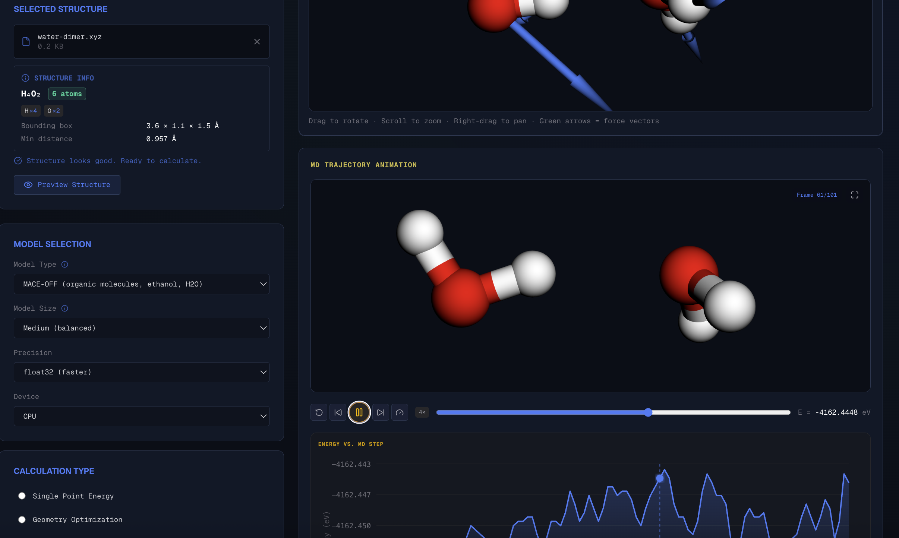
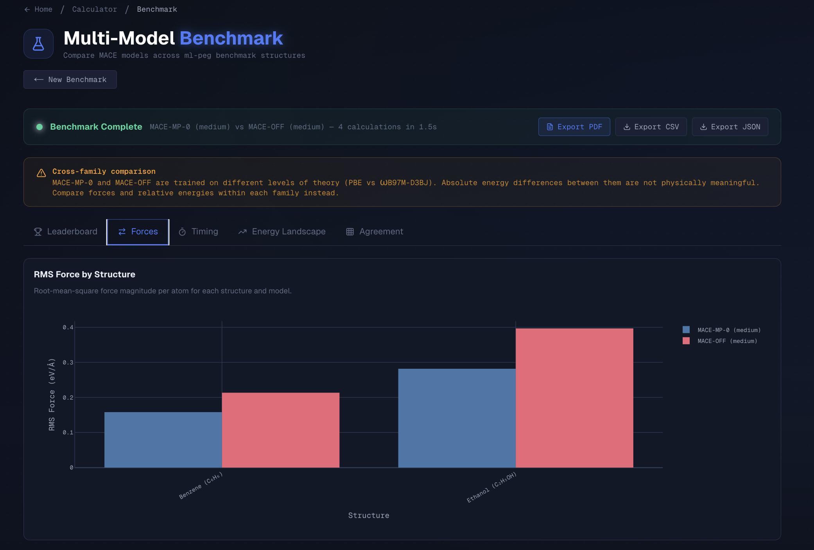

<div align="center">

# SimpleAtom

**Run DFT-accuracy atomistic simulations entirely in your browser.**
**No installation. No command line.**

<h3>
  <a href="https://mace-lake.vercel.app"> Live → mace-lake.vercel.app</a>
</h3>

<p>
  <a href="https://mace-lake.vercel.app"></a>
</p>

<p>
  <a href="https://github.com/Jamessfks/mace/releases"></a>
  <a href="https://github.com/Jamessfks/mace/blob/main/LICENSE"></a>
  <a href="https://www.python.org/"></a>
  <a href="https://nextjs.org/"></a>
  <a href="https://github.com/ACEsuit/mace"></a>
  <a href="https://github.com/Jamessfks/mace"></a>
  <a href="https://github.com/Jamessfks/mace"></a>
  <a href="https://mace-web-interface.readthedocs.io/en/latest/"></a>
</p>

Contact: zhao.zic@northeastern.edu or zezepy070413@gmail.com

[Documentation](https://mace-web-interface.readthedocs.io/en/latest/) · [What's New in v1.2.0](#whats-new-in-v120-stable) · [See It in Action](#see-it-in-action) · [Why This Exists](#why-this-exists) · [Key Features](#key-features) · [Quick Start](#quick-start) · [Architecture](#architecture) · [Deploy](#deploy-online)

</div>

---

## What's New in v1.2.0 Stable

> **First stable release** — verified with automated scientific validation and hands-on testing of students at Northeastern University.

- **Validated end-to-end**: single-point, geometry optimization (BFGS), and MD (NVE/NVT/NPT) verified across MACE-MP-0 and MACE-OFF on 14 benchmark structures
- **Scientific validation suite** (`validate_calculation.py`): model-aware energy bounds, force conservation, D3 double-counting detection, trajectory stability checks
- **Verified accuracy**: Si bulk at -5.37 eV/atom with equilibrium forces ~0; H2O with perfect force conservation; ethanol opt converges in 4 steps
- Removed experimental 2D sketcher; streamlined to file-upload and catalog workflow

---

## See It in Action

<div align="center">

<table>
<tr>
<td width="50%" align="center">
<br/>
<strong>Web Calculator</strong>
<br/><br/>
<a href="https://mace-lake.vercel.app/calculate"></a>
<br/>
<sub>Upload a structure, configure the model and parameters,<br/>then explore results with a 3D viewer, trajectory animation, and energy charts.</sub>
<br/><br/>
</td>
<td width="50%" align="center">
<br/>
<strong>Multi-Model Benchmark</strong>
<br/><br/>
<a href="https://mace-lake.vercel.app/benchmark"></a>
<br/>
<sub>Batch-evaluate models across multiple structures. Sortable leaderboard,<br/>force comparison charts, timing analysis.</sub>
<br/><br/>
</td>
</tr>
<tr>
<td width="50%" align="center">
<br/>
<strong>MACE Link — Share Results</strong>
<br/><br/>
<a href="https://mace-lake.vercel.app/r/gK7tabOE"></a>
<br/>
<sub>Every calculation becomes a permanent, shareable link. The full dashboard —<br/>energy, forces, 3D viewer, exports.</sub>
<br/><br/>
</td>
<td width="50%" align="center">
</td>
</tr>
</table>

</div>

<div align="center">

### Full Walkthrough

[](https://drive.google.com/file/d/1VJX2zz52lPSK7c-eqCeQAdVylE4gjE7w/view?usp=sharing)

*Click the image above to watch the full walkthrough video.*

</div>

---

## Why This Exists

> *"In the science community, you rarely see a disabled scientist."*
>
> *How many talented scientists are we losing because of inaccessible tools? We want to be the pioneers of creating an accessible scientific web interface, encouraging the science community to respect people with needs.*

Machine learning interatomic potentials like [MACE](https://github.com/ACEsuit/mace) (NeurIPS 2022) have reached a point where they rival density functional theory in accuracy while running orders of magnitude faster. But using them still requires Python scripting, command-line fluency, and environment setup that shuts out a large number of researchers, especially those with accessibility needs, those in under-resourced labs, or students encountering computational chemistry for the first time.

This project removes that barrier. Upload a crystal structure or pick one from a catalog and get publication-quality results in seconds, from any browser.

---

## Key Features

### MACE Link — Shareable Permanent Results

Every calculation can be shared as a permanent URL. Click **Share Result**, get a link like `mace-lake.vercel.app/r/gK7tabOE`, and anyone can view the full result — 3D viewer, metrics, charts, export options — without logging in. Results are stored in Supabase with row-level security: once created, a shared result cannot be modified or deleted.

### Scientific Calculator

| Capability | Details |
|---|---|
| **Structure input** | Drag-and-drop upload (`.xyz`, `.cif`, `.poscar`, `.pdb`) or ml-peg catalog (14 benchmark structures across 5 categories) |
| **Foundation models** | MACE-MP-0 (89 elements, materials & crystals) and MACE-OFF (organic molecules, DFT-level accuracy). Small, medium, and large variants |
| **Custom models** | Upload your own `.model` file — compare side-by-side against foundation models with radar charts (MAE, RMSE, R2) |
| **Calculation types** | Single-point energy & forces, geometry optimization (BFGS), molecular dynamics (NVE / NVT / NPT) |
| **Parameter control** | Temperature, pressure, time step, friction, MD steps, force threshold, D3 dispersion correction, precision, device |

### Visualization & Analysis

| Feature | Details |
|---|---|
| **3D molecular viewer** | Dual-engine rendering (3Dmol.js + WEAS) with force vector overlays, multiple representations, spin, and fullscreen |
| **Metrics dashboard** | Five-tab interface — Summary, Forces, Energy, Structure, Raw Data — with interactive Plotly charts |
| **MD trajectory player** | Frame-by-frame animation with playback controls, adjustable speed, and an energy chart synced to the current frame |
| **Structure intelligence** | Auto-detects format, counts atoms and elements, computes bounding box, warns about large structures or multi-frame files |
| **Export** | PDF reports, CSV force tables, JSON results, PNG/SVG charts — everything needed for a publication or notebook |

### Multi-Model Benchmark Suite

Navigate to `/benchmark` to batch-evaluate 2-3 models across multiple structures. Results include a sortable leaderboard, force comparison bar charts, timing analysis with speedup ratios, energy landscape plots, and a pairwise model agreement heatmap. Export everything as CSV, JSON, or a formatted PDF.

### Accessibility & Design

The interface is built with accessibility as a first principle, not an afterthought:

- **Keyboard navigation** throughout — focus rings, Space to play/pause trajectory animations
- **ARIA labels and semantic HTML** — screen readers can traverse the full calculation workflow
- **Colorblind-safe data palette** — Paul Tol's qualitative scheme across all visualizations
- **Dark scientific aesthetic** — ambient glow effects, dot-grid patterns, and an animated water MD simulation on the landing page, inspired by research-tool interfaces

---

## Quick Start

```bash
git clone https://github.com/Jamessfks/mace.git && cd mace
npm install                    # frontend dependencies
pip install mace-torch ase     # backend (MACE + ASE)
npm run dev                    # → http://localhost:3000
```

> The first calculation takes ~30 seconds while models download. Subsequent runs are fast.

**Try the guided demo:** visit `http://localhost:3000/calculate?demo=true` — it loads an ethanol molecule and walks you through the interface step by step.

### Verify Your Installation

```bash
# Run the automated scientific validation suite
python mace-api/validate_calculation.py --test
```

This runs 5 tests: Si bulk with MACE-MP-0, H2O with MACE-OFF, ethanol geometry optimization, force conservation check, and result validation. All must pass for a correct installation.

---

## Architecture

```
Browser (localhost:3000)
    |
    |-- /                           Landing page with animated water MD background
    |
    |-- /calculate                  Calculator — upload structure, configure, run MACE
    |
    |-- /benchmark                  Multi-model benchmark suite
    |
    |-- /r/[id]                     MACE Link — shared result viewer
    |
    v
    Next.js API Routes
         |-- /api/calculate         MACE calculation (single-point / opt / MD)
         |-- /api/benchmark         Batch evaluation (model x structure pairs)
         |-- /api/generate-surface  Surface slab generation (ASE)
    |
    v
    Python Backend (ASE + mace-torch)
         |-- calculate_local.py     Subprocess runner (local mode)
         |-- main.py                FastAPI server (remote mode)
         |-- validate_calculation.py  Scientific result validator
    |
    v
    Supabase                        Shared results storage (RLS-protected)
```

| Mode | When | How |
|------|------|-----|
| **Local** | `MACE_API_URL` not set | Python subprocess on same machine |
| **Remote** | `MACE_API_URL` set | Forwards to hosted FastAPI (e.g. Hugging Face Spaces) |

### Key Technologies

| Layer | Stack |
|-------|-------|
| Frontend | Next.js 16, React 19, TypeScript, Tailwind CSS 4 |
| 3D rendering | 3Dmol.js, WEAS widget |
| Charts | Plotly.js, Recharts |
| Chemistry | mace-torch (v0.3.14+), ASE (v3.27+) |
| Data | Supabase (Postgres + row-level security) |
| Reports | @react-pdf/renderer |

---

## Deploy Online

| Step | Frontend (Vercel) | Backend (Hugging Face Spaces) |
|------|-------------------|-------------------------------|
| 1 | Push to GitHub | Create a new Space at huggingface.co (SDK: Docker) |
| 2 | Import repo at vercel.com | Push `mace-api/` contents to the Space repo |
| 3 | Set `MACE_API_URL` and Supabase env vars | Copy the Space URL (e.g. `https://<user>-mace-api.hf.space`) |

---

## Models

| Model | Best For | Elements | Training Data |
|-------|----------|----------|---------------|
| **MACE-MP-0** | Materials, crystals, surfaces | 89 elements | Materials Project DFT (PBE+U) |
| **MACE-OFF** | Organic molecules, drug-like compounds | H, C, N, O, F, P, S, Cl, Br, I | wB97M-D3BJ coupled-cluster quality |
| **Custom** | Domain-specific accuracy | Your training set | Upload `.model` file |

> **Note:** MACE-MP-0 is trained at PBE+U level, which typically overbinds by 0.1-0.5 eV/atom relative to experiment. MACE-OFF already includes D3 dispersion in its training data — do not enable D3 correction when using MACE-OFF.

---

## Project Structure

<details>
<summary><strong>Click to expand full file tree</strong></summary>

```
mace/
  app/
    api/
      calculate/route.ts              # Single-structure calculation API
      benchmark/route.ts              # Batch benchmark API (model x structure)
      generate-surface/route.ts       # Surface slab generation via ASE
    calculate/page.tsx                # Calculator page — upload, configure, run
    benchmark/
      page.tsx                        # Multi-model benchmark page
      loading.tsx                     # Loading spinner
    r/[id]/
      page.tsx                        # MACE Link server component (data fetch)
      shared-result-view.tsx          # MACE Link client component (full dashboard)
    globals.css                       # Design system (CSS custom properties)
    layout.tsx                        # Root layout + metadata
    page.tsx                          # Landing page with animated hero
  components/
    calculate/
      charts/
        chart-config.ts               # Shared Plotly config + colorblind-safe palette
        parity-plot.tsx               # Predicted vs. reference scatter plot
        error-histogram.tsx           # Error distribution histogram
        energy-convergence.tsx        # Energy vs. step line chart
        radar-comparison.tsx          # Multi-metric spider chart
      trajectory/
        trajectory-viewer.tsx         # MD animation player with controls
        energy-chart.tsx              # SVG energy chart synced to frames
      file-upload-section.tsx         # Drag-and-drop upload + ml-peg catalog
      metrics-dashboard.tsx           # Tabbed results dashboard (5 tabs)
      mlpeg-catalog.tsx               # Benchmark structure browser
      model-comparison.tsx            # Custom vs. foundation model comparison
      molecule-viewer-3d.tsx          # 3Dmol.js + WEAS dual-engine viewer
      parameter-panel.tsx             # Model selection + calculation params
      pdf-report.tsx                  # PDF report generator
      structure-info.tsx              # Auto-parsed structure summary + warnings
      structure-preview.tsx           # Click-to-display 3D preview
      weas-viewer.tsx                 # WEAS iframe viewer
    benchmark/
      benchmark-config.tsx            # Model + structure selection panel
      benchmark-dashboard.tsx         # Tabbed results container (5 tabs)
      benchmark-leaderboard.tsx       # Sortable energy/atom comparison table
      benchmark-force-bars.tsx        # RMS force bar chart + per-atom table
      benchmark-timing.tsx            # Timing bar chart + speedup ratios
      benchmark-energy-landscape.tsx  # Energy/atom scatter+line plot
      benchmark-heatmap.tsx           # Pairwise model agreement heatmap
      benchmark-export.tsx            # CSV / JSON / PDF export
    ui/                               # shadcn/ui primitives
    intro-section.tsx                 # Landing page hero + features grid
    water-md-canvas.tsx               # Animated Three.js water background
  lib/
    mlpeg-catalog.ts                  # ml-peg structure definitions (14 structures)
    parse-structure.ts                # Multi-format structure parser
    share.ts                          # MACE Link: save/load shared results (Supabase)
    supabase.ts                       # Supabase client singleton
    utils.ts
  mace-api/
    Dockerfile                        # Docker image for HF Spaces deployment
    calculate_local.py                # Standalone MACE calculation script
    generate_surface.py               # ASE surface slab generator
    main.py                           # FastAPI server for cloud deployment
    validate_calculation.py           # Scientific result validation suite
    requirements.txt
  types/
    mace.ts                           # TypeScript type definitions
  public/
    demo/                             # Demo structures (ethanol.xyz, water.xyz)
```

</details>

---

## Validation

The project includes an automated scientific validation suite that verifies calculation correctness:

```bash
python mace-api/validate_calculation.py --test
```

| Test | What It Checks |
|------|----------------|
| MACE-MP-0 Si bulk | Energy/atom in correct range (-5.37 eV), equilibrium forces near zero |
| MACE-OFF H2O | Energy computed, force conservation (net force = 0) |
| Ethanol geometry opt | Energy decreases during optimization, converges within step limit |
| Force conservation | Newton's 3rd law: sum of forces on isolated molecule equals zero |
| Result validation | Physical bounds (energy, forces, distances, volume) all pass |

You can also validate individual calculation results:

```bash
python mace-api/validate_calculation.py '<result_json>'
python mace-api/validate_calculation.py result.json
```

---

## Troubleshooting

| Problem | Solution |
|---------|----------|
| First calculation slow (~30s) | Normal — model downloads on first use, cached afterward |
| `mace-torch` install fails | Install PyTorch first: `pip install torch`. Requires Python 3.10+ |
| CUDA out of memory | Switch to CPU in the parameter panel, or use a smaller model |
| `torch.load` / `weights_only` error | PyTorch 2.6+ issue — already patched in `calculate_local.py`. Run `pip install --upgrade mace-torch` |
| MACE-OFF element error | MACE-OFF only supports 10 organic elements. Use MACE-MP-0 for metals/inorganics |
| Shared link shows "not found" | The result ID may be invalid. Shared results are permanent once created |
| Validation suite fails | Run `pip install mace-torch ase` to ensure dependencies are installed |

---

## Acknowledgments

Built on the [MACE framework](https://github.com/ACEsuit/mace) by Batatia et al. (NeurIPS 2022). 3D visualization powered by [3Dmol.js](https://3dmol.csb.pitt.edu/) and [WEAS](https://github.com/superstar54/weas). The ml-peg benchmark structures are sourced from established computational materials science datasets.

---

<div align="center">

**v1.2.0 Stable** · Academic use · MACE-OFF under [Academic Software License](https://github.com/gabor1/ASL)

</div>
