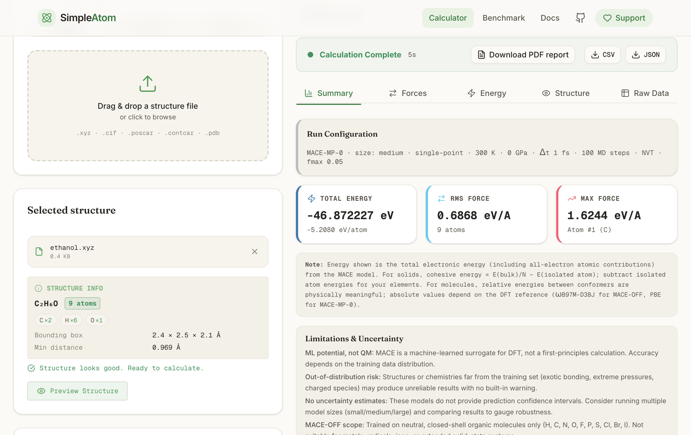
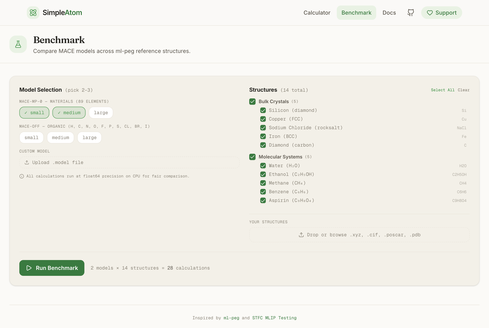
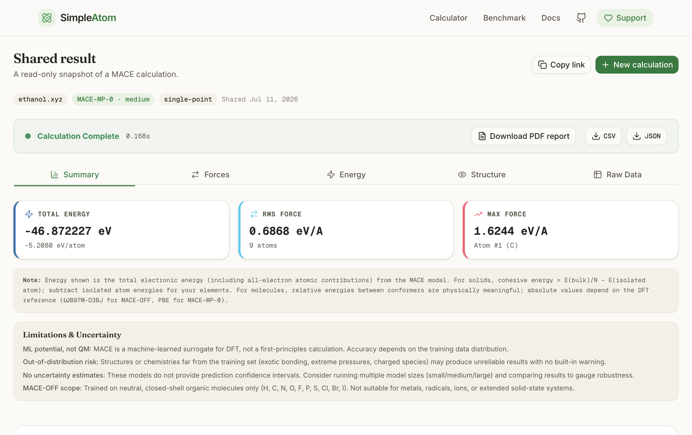
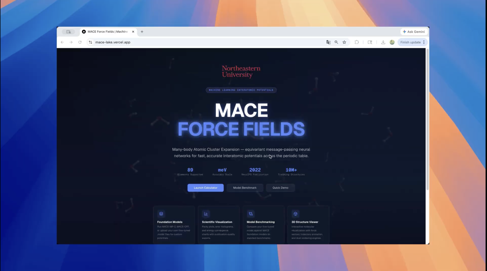

<div align="center">

# SimpleAtom

**Run DFT-accuracy atomistic simulations entirely in your browser.**
**No installation. No command line.**

<h3>
  <a href="https://mace-lake.vercel.app"> Live → mace-lake.vercel.app</a>
</h3>

<p>
  <a href="https://mace-lake.vercel.app"></a>
</p>

<p>
  <a href="https://github.com/Jamessfks/mace/releases"></a>
  <a href="https://github.com/Jamessfks/mace/blob/main/LICENSE"></a>
  <a href="https://www.python.org/"></a>
  <a href="https://nextjs.org/"></a>
  <a href="https://github.com/ACEsuit/mace"></a>
  <a href="#scientific-integrity"></a>
  <a href="#validation"></a>
  <a href="https://mace-lake.vercel.app/docs"></a>
</p>

Contact: zhao.zic@northeastern.edu or zezepy070413@gmail.com

[Documentation](https://mace-lake.vercel.app/docs) · [What's New in v2.0](#whats-new-in-v20) · [Scientific Integrity](#scientific-integrity) · [See It in Action](#see-it-in-action) · [Key Features](#key-features) · [Quick Start](#quick-start) · [Architecture](#architecture) · [Deploy](#deploy-online)

</div>

---

## What's New in v2.0

> v2.0 was built by measuring SimpleAtom against three real references rather than against
> our own judgement: [Rowan](https://rowansci.com) for interface quality,
> [the Materials Project](https://next-gen.materialsproject.org) for data presentation, and
> [ACEsuit/mace](https://github.com/ACEsuit/mace) — the reference implementation — for
> scientific correctness. The last one found bugs the first two never could.

**Calculations now fail loudly instead of quietly returning the wrong thing.**

- `calculationType` and `modelType` are validated against explicit allow-lists in the Python
  backend, which is the real security boundary — the API is callable directly. Previously an
  unrecognised calculation type silently ran a single-point and returned it as whatever was
  asked for, and selecting a custom model without uploading a checkpoint returned MACE-MP-0
  results labelled `custom`.
- Geometry optimisation reports whether it **actually converged**. A run that exhausts
  `maxOptSteps` without reaching `fmax` is no longer described as completed.
- Results echo the parameters that *actually ran* — defaults resolved, CUDA→CPU fallback
  applied, the real dispersion state, and the precision read off the loaded model.

**Molecular dynamics is reproducible and correctly reported.**

- Every stochastic source is seeded from one generator, and the seed is recorded in the
  result message so it survives sharing and PDF export. Two runs at the same seed produce
  identical trajectories.
- Trajectories now record potential, kinetic **and total** energy plus temperature. The MD
  chart previously plotted potential energy under a "total energy" label, which made the NVE
  conservation the docs tell you to check impossible to see. Measured on a real run: total
  drifts 1.4 meV while potential swings 112 meV.
- Centre-of-mass drift is removed after velocity initialisation, so reported temperature is
  no longer inflated by rigid translation.

**Scientific guardrails are enforced at the point of entry.**

- MACE-OFF warns when the structure contains elements outside its coverage
  (H, C, N, O, F, P, S, Cl, Br, I); NPT is disabled without a periodic cell; the MD timestep
  ceiling dropped from 10 fs to 4 fs; D3 dispersion is locked out where it would double-count.
- Every numeric input shows its unit and valid range.

**Fixes worth calling out.**

- **CIF fractional coordinates were never converted through the unit cell.** Materials Project
  CIFs use fractional coordinates, so loading one packed every atom into a 1 Å box — silicon
  came out with a 0.433 Å nearest-neighbour distance instead of 2.3516 Å.
  `public/demo/silicon.cif` now guards this.
- **D3 dispersion never worked.** `torch-dftd` was in neither our requirements nor
  mace-torch's, so enabling it always failed — after downloading the model.
- Precision now follows upstream's own defaults (float64 for MACE-OFF and for geometry
  optimisation) instead of being pinned to float32.
- Docs and landing copy advertised a FIRE optimiser that does not exist; BFGS is hardcoded.

<details>
<summary><b>What was in v1.3.0</b></summary>

> A ground-up redesign focused on being genuinely useful to the science community — clearer, more accessible, and more honest about the science.

- **New humanist interface** — a warm, low-contrast light theme with a light-green accent and a serif display face, replacing the previous dark theme. Designed to feel calm and readable, not like a high-contrast "AI" dashboard.
- **Rebranded to SimpleAtom** — one consistent name across the app.
- **In-app documentation** at [`/docs`](https://mace-lake.vercel.app/docs) — foundation models, calculation types & parameters, units & conventions, validation & reproducibility, and an FAQ, written to be accessible yet rigorous.
- **Expanded structure input** — file upload (`.xyz`, `.cif`, `.poscar`, `.pdb`), the ml-peg benchmark catalog, **SMILES → 3D** generation, and a **2D/3D molecular sketcher** (Ketcher).
- **Recent calculations** — an account-free history stored locally in your browser (nothing is uploaded).
- **Environment-aware links** — shareable, citation, and export URLs now derive from the live origin instead of a hardcoded host.
- **Accessibility** — shadcn/Radix primitives with proper roles and ARIA, keyboard navigation, `prefers-reduced-motion` support, and the colorblind-safe Paul Tol palette across all charts.
- **Correctness fixes** — removed a misleading Energy R² metric that was hardcoded to 1.0 for a single data point (now reports the signed energy error vs. a reference), and D3 dispersion is now automatically disabled for MACE-OFF, which already includes dispersion.

</details>

---

## Scientific Integrity

SimpleAtom is a wrapper around [MACE](https://github.com/ACEsuit/mace). A wrapper's main risk
is not crashing — it is returning a plausible number for something that never ran. v2.0 was
audited specifically for that failure mode, and found six instances of it.

Every one reviewed as correct code. None would have been caught by reading a diff.

| What looked fine | What it actually did |
|---|---|
| `calculationType` dispatch | No `else` branch — any unrecognised type ran a single-point and returned it as the requested calculation |
| `modelType` dispatch | No allow-list — "custom" with no checkpoint returned MACE-MP-0 results labelled `custom`, shareable and exportable |
| The result validator | Its model-aware energy bounds never fired, because the backend never echoed the parameters the validator reads |
| The D3 dispersion toggle | Live in the UI, but a silent no-op for custom models, whose loader takes no dispersion argument |
| MACE-OFF element / NPT guards | Implemented correctly and never invoked — nothing passed them the structure |
| `parseCIF` | Read fractional coordinates and never multiplied them through the cell: silicon at 0.433 Å instead of 2.3516 Å |

**The principle that came out of it:** an unsupported request must fail loudly. A stub that
returns plausible numbers for a calculation that never ran is worse than an error, because
the error is visible and the number is not.

### Verifying it yourself

These must all fail. If any returns a result, a silent fallthrough has come back:

```bash
export KMP_DUPLICATE_LIB_OK=TRUE
python3 mace-api/calculate_local.py public/demo/ethanol.xyz '{"calculationType":"phonon"}'
python3 mace-api/calculate_local.py public/demo/ethanol.xyz '{"modelType":"custom"}'
python3 mace-api/calculate_local.py public/demo/ethanol.xyz '{"modelType":"MACE-MP"}'
```

And this must hold — it regresses to a 1 Å box if fractional-coordinate handling breaks:

```bash
# public/demo/silicon.cif — correct nearest-neighbour is 2.3516 Å (a·√3/4)
```

### Reproducibility

Every MD run is seeded (`DEFAULT_MD_SEED = 42`, override with `params["seed"]`) and the seed
is recorded in the result *message*, not just the parameters — the message survives MACE Link
sharing and PDF export, which is exactly where reproducibility matters. Two runs at the same
seed produce byte-identical trajectories.

### What SimpleAtom deliberately cannot do

MACE is an interatomic potential. It produces energies, forces and stress, and has **no
electron density** — so orbitals, partial charges, Fukui indices, pKa, redox potentials and
NMR shifts are not approximated, stubbed or hidden behind a "coming soon" toggle. They are
absent, and `phonon` is rejected with an error rather than quietly running something else.

---

## See It in Action

<div align="center">

<table>
<tr>
<td width="50%" align="center">
<br/>
<strong>Web Calculator</strong>
<br/><br/>
<a href="https://mace-lake.vercel.app/calculate"></a>
<br/>
<sub>Upload or sketch a structure, configure the model and parameters,<br/>then explore results with a 3D viewer, trajectory animation, and energy charts.</sub>
<br/><br/>
</td>
<td width="50%" align="center">
<br/>
<strong>Multi-Model Benchmark</strong>
<br/><br/>
<a href="https://mace-lake.vercel.app/benchmark"></a>
<br/>
<sub>Batch-evaluate models across multiple structures. Sortable leaderboard,<br/>force comparison charts, timing analysis.</sub>
<br/><br/>
</td>
</tr>
<tr>
<td width="50%" align="center">
<br/>
<strong>MACE Link — Share Results</strong>
<br/><br/>
<a href="https://mace-lake.vercel.app/r/gK7tabOE"></a>
<br/>
<sub>Every calculation becomes a permanent, shareable link. The full dashboard —<br/>energy, forces, 3D viewer, exports.</sub>
<br/><br/>
</td>
<td width="50%" align="center">
</td>
</tr>
</table>

<sub><em>Screenshots above reflect earlier releases; the v1.3.0 interface is live at the links.</em></sub>

</div>

<div align="center">

### Full Walkthrough

[](https://drive.google.com/file/d/1VJX2zz52lPSK7c-eqCeQAdVylE4gjE7w/view?usp=sharing)

*Click the image above to watch the full walkthrough video.*

</div>

---

## Why This Exists

> *"In the science community, you rarely see a disabled scientist."*
>
> *How many talented scientists are we losing because of inaccessible tools? We want to be the pioneers of creating an accessible scientific web interface, encouraging the science community to respect people with needs.*

Machine learning interatomic potentials like [MACE](https://github.com/ACEsuit/mace) (NeurIPS 2022) have reached a point where they rival density functional theory in accuracy while running orders of magnitude faster. But using them still requires Python scripting, command-line fluency, and environment setup that shuts out a large number of researchers, especially those with accessibility needs, those in under-resourced labs, or students encountering computational chemistry for the first time.

This project removes that barrier. Upload a crystal structure or pick one from a catalog and get publication-quality results in seconds, from any browser.

---

## Key Features

### MACE Link — Shareable Permanent Results

Every calculation can be shared as a permanent URL. Click **Share Result**, get a link like `mace-lake.vercel.app/r/gK7tabOE`, and anyone can view the full result — 3D viewer, metrics, charts, export options — without logging in. Results are stored in Supabase with row-level security: once created, a shared result cannot be modified or deleted.

### Scientific Calculator

| Capability | Details |
|---|---|
| **Structure input** | Drag-and-drop upload (`.xyz`, `.cif`, `.poscar`, `.pdb`), the ml-peg catalog (14 benchmark structures across 5 categories), **SMILES → 3D** (RDKit), or a **2D/3D molecular sketcher** (Ketcher) |
| **Foundation models** | MACE-MP-0 (89 elements, materials & crystals) and MACE-OFF (organic molecules, DFT-level accuracy). Small, medium, and large variants |
| **Custom models** | Upload your own `.model` file — compare side-by-side against foundation models with agreement metrics (MAE, RMSE, R²) |
| **Calculation types** | Single-point energy & forces, geometry optimization (BFGS), molecular dynamics (NVE / NVT / NPT) |
| **Parameter control** | Temperature, pressure, time step, friction, MD steps, force threshold, D3 dispersion (MACE-MP-0 only), precision, device |

### Visualization & Analysis

| Feature | Details |
|---|---|
| **3D molecular viewer** | Dual-engine rendering (3Dmol.js + WEAS) with force vector overlays, multiple representations, spin, and fullscreen |
| **Metrics dashboard** | Five-tab interface — Summary, Forces, Energy, Structure, Raw Data — with interactive Plotly charts |
| **MD trajectory player** | Frame-by-frame animation with playback controls, adjustable speed, and an energy chart synced to the current frame |
| **Structure intelligence** | Auto-detects format, counts atoms and elements, computes bounding box, warns about large structures or multi-frame files |
| **Export** | PDF reports, CSV force tables, JSON results, PNG/SVG charts — everything needed for a publication or notebook |

### Multi-Model Benchmark Suite

Navigate to `/benchmark` to batch-evaluate 2–3 models across multiple structures. Results include a sortable leaderboard, force comparison bar charts, timing analysis with speedup ratios, energy landscape plots, and a pairwise model agreement heatmap. Export everything as CSV, JSON, or a formatted PDF.

### In-App Documentation

The [`/docs`](https://mace-lake.vercel.app/docs) section explains the science behind the tool — foundation models and their levels of theory, each calculation type and its parameters, unit conventions (eV / eV·Å⁻¹ / Å / K / fs), how results are validated, and how to cite them.

### Accessibility & Design

The interface is built with accessibility as a first principle, not an afterthought:

- **Keyboard navigation** throughout — focus rings, Space to play/pause trajectory animations
- **ARIA roles and semantic HTML** — screen readers can traverse the full calculation workflow; tabs, status, and controls are properly labeled
- **Colorblind-safe data palette** — Paul Tol's qualitative scheme across all visualizations
- **Reduced-motion support** and a calm, warm, low-contrast light theme designed for long reading sessions

---

## Quick Start

```bash
git clone https://github.com/Jamessfks/mace.git && cd mace
npm install                          # frontend dependencies
pip install -r mace-api/requirements.txt   # backend: MACE + ASE + torch-dftd
npm run dev                          # → http://localhost:3000
```

> The first calculation takes ~30 seconds while models download. Subsequent runs are fast.

> **On macOS**, export `KMP_DUPLICATE_LIB_OK=TRUE` before running the backend from a shell,
> or PyTorch aborts with `OMP: Error #15`. The API route already sets this for you.

> `torch-dftd` is only needed for D3 dispersion (MACE-MP-0). It pulls in pymatgen, about
> 130 MB installed. Skip it with `pip install mace-torch ase` if you do not need dispersion —
> the backend then rejects `dispersion: true` with a clear message instead of failing deep
> inside the model load.

**Try the guided demo:** visit `http://localhost:3000/calculate?demo=true` — it loads an ethanol molecule and walks you through the interface step by step.

### Verify Your Installation

```bash
# Run the automated scientific validation suite
python test_scripts/validate_calculation.py --test
```

This runs 5 tests: Si bulk with MACE-MP-0, H2O with MACE-OFF, ethanol geometry optimization, force conservation check, and result validation. All must pass for a correct installation.

---

## Architecture

```
Browser (localhost:3000)
    |
    |-- /                           Landing page
    |-- /calculate                  Calculator — upload/sketch structure, configure, run MACE
    |-- /benchmark                  Multi-model benchmark suite
    |-- /docs                       In-app documentation
    |-- /r/[id]                     MACE Link — shared result viewer
    |
    v
    Next.js API Routes
         |-- /api/calculate         MACE calculation (single-point / opt / MD)
         |-- /api/benchmark         Batch evaluation (model x structure pairs)
         |-- /api/smiles-to-xyz     SMILES → 3D structure (RDKit)
    |
    v
    Python Backend (ASE + mace-torch)
         |-- calculate_local.py     Subprocess runner (local mode)
         |-- main.py                FastAPI server (remote mode)
         |-- smiles_to_xyz.py       SMILES → XYZ conversion (RDKit)
         |-- validate_calculation.py  Scientific result validator
    |
    v
    Supabase                        Shared results storage (RLS-protected)
```

| Mode | When | How |
|------|------|-----|
| **Local** | `MACE_API_URL` not set | Python subprocess on same machine |
| **Remote** | `MACE_API_URL` set | Forwards to hosted FastAPI (e.g. Hugging Face Spaces) |

### Key Technologies

| Layer | Stack |
|-------|-------|
| Frontend | Next.js 16, React 19, TypeScript, Tailwind CSS 4, shadcn/ui |
| 3D rendering | 3Dmol.js, WEAS widget |
| Charts | Plotly.js, Recharts |
| Chemistry | mace-torch (v0.3.14+), ASE (v3.27+) |
| Data | Supabase (Postgres + row-level security) |
| Reports | @react-pdf/renderer |

### Configuration

| Env var | Purpose |
|---------|---------|
| `NEXT_PUBLIC_SUPABASE_URL` | Supabase project URL (MACE Link sharing) |
| `NEXT_PUBLIC_SUPABASE_ANON_KEY` | Supabase anonymous key |
| `MACE_API_URL` | Remote backend URL (omit for local subprocess mode) |
| `NEXT_PUBLIC_SITE_URL` | Canonical site origin for share/citation links (optional) |

---

## Deploy Online

| Step | Frontend (Vercel) | Backend (Hugging Face Spaces) |
|------|-------------------|-------------------------------|
| 1 | Push to GitHub | Create a new Space at huggingface.co (SDK: Docker) |
| 2 | Import repo at vercel.com | Push `mace-api/` contents to the Space repo |
| 3 | Set `MACE_API_URL` and Supabase env vars | Copy the Space URL (e.g. `https://<user>-mace-api.hf.space`) |

---

## Models

| Model | Best For | Elements | Training Data |
|-------|----------|----------|---------------|
| **MACE-MP-0** | Materials, crystals, surfaces | 89 elements | Materials Project DFT (PBE+U) |
| **MACE-OFF** | Organic molecules, drug-like compounds | H, C, N, O, F, P, S, Cl, Br, I | ωB97M-D3BJ reference data |
| **Custom** | Domain-specific accuracy | Your training set | Upload `.model` file |

> **Note:** MACE-MP-0 is trained at PBE+U level, which typically overbinds by 0.1–0.5 eV/atom relative to experiment. MACE-OFF already includes D3 dispersion in its training data — the D3 correction is disabled automatically when MACE-OFF is selected.

---

## Project Structure

<details>
<summary><strong>Click to expand file tree</strong></summary>

```
mace/
  app/
    api/
      calculate/route.ts              # Single-structure calculation API
      benchmark/route.ts              # Batch benchmark API (model x structure)
      smiles-to-xyz/route.ts          # SMILES → 3D structure (RDKit)
    calculate/page.tsx                # Calculator — upload/sketch, configure, run
    benchmark/page.tsx                # Multi-model benchmark page
    docs/                             # In-app documentation (layout + pages)
    r/[id]/                           # MACE Link shared result (server + client view)
    globals.css                       # Design system (CSS custom properties)
    layout.tsx                        # Root layout + metadata + TooltipProvider
    page.tsx                          # Landing page
  components/
    site-header.tsx                   # Shared top navigation
    site-footer.tsx                   # Shared footer
    intro-section.tsx                 # Landing hero + feature/workflow sections
    docs/                             # Docs sidebar, pager, callout
    calculate/                        # Calculator UI (upload, params, dashboard, charts, viewers)
    benchmark/                        # Benchmark UI (config, leaderboard, heatmap, ...)
    ui/                               # shadcn/ui primitives
  lib/
    mlpeg-catalog.ts                  # ml-peg structure definitions (14 structures)
    parse-structure.ts                # Multi-format structure parser
    share.ts                          # MACE Link: save/load shared results (Supabase)
    site.ts                           # Env-driven canonical site origin
    history.ts                        # Local (browser) recent-calculations history
    supabase.ts                       # Supabase client singleton
    utils.ts
  mace-api/
    Dockerfile                        # Docker image for HF Spaces deployment
    calculate_local.py                # Standalone MACE calculation script
    main.py                           # FastAPI server for cloud deployment
    smiles_to_xyz.py                  # SMILES → XYZ conversion (RDKit)
    validate_calculation.py           # Scientific result validation suite
    requirements.txt
  types/mace.ts                       # TypeScript type definitions
  docs/                               # MkDocs source (mirrors the in-app docs)
  public/demo/                        # Demo structures (ethanol.xyz, water.xyz)
```

</details>

---

## Validation

The project includes an automated scientific validation suite that verifies calculation correctness:

```bash
python test_scripts/validate_calculation.py --test
```

| Test | What It Checks |
|------|----------------|
| MACE-MP-0 Si bulk | Energy/atom in correct range (-5.37 eV), equilibrium forces near zero |
| MACE-OFF H2O | Energy computed, force conservation (net force = 0) |
| Ethanol geometry opt | Energy decreases during optimization, converges within step limit |
| Force conservation | Newton's 3rd law: sum of forces on isolated molecule equals zero |
| Result validation | Physical bounds (energy, forces, distances, volume) all pass |

You can also validate individual calculation results:

```bash
python test_scripts/validate_calculation.py '<result_json>'
python test_scripts/validate_calculation.py result.json
```

---

## Troubleshooting

| Problem | Solution |
|---------|----------|
| First calculation slow (~30s) | Normal — model downloads on first use, cached afterward |
| `mace-torch` install fails | Install PyTorch first: `pip install torch`. Requires Python 3.10+ |
| CUDA out of memory | Switch to CPU in the parameter panel, or use a smaller model |
| `torch.load` / `weights_only` error | PyTorch 2.6+ issue — already patched in `calculate_local.py`. Run `pip install --upgrade mace-torch` |
| MACE-OFF element error | MACE-OFF only supports 10 organic elements. Use MACE-MP-0 for metals/inorganics |
| Shared link shows "not found" | The result ID may be invalid. Shared results are permanent once created |
| Validation suite fails | Run `pip install mace-torch ase` to ensure dependencies are installed |

---

## Acknowledgments

Built on the [MACE framework](https://github.com/ACEsuit/mace) by Batatia et al. (NeurIPS 2022). 3D visualization powered by [3Dmol.js](https://3dmol.csb.pitt.edu/) and [WEAS](https://github.com/superstar54/weas). The ml-peg benchmark structures are sourced from established computational materials science datasets.

---

<div align="center">

**v1.3.0** · Academic use · MACE-OFF under [Academic Software License](https://github.com/gabor1/ASL)

</div>
